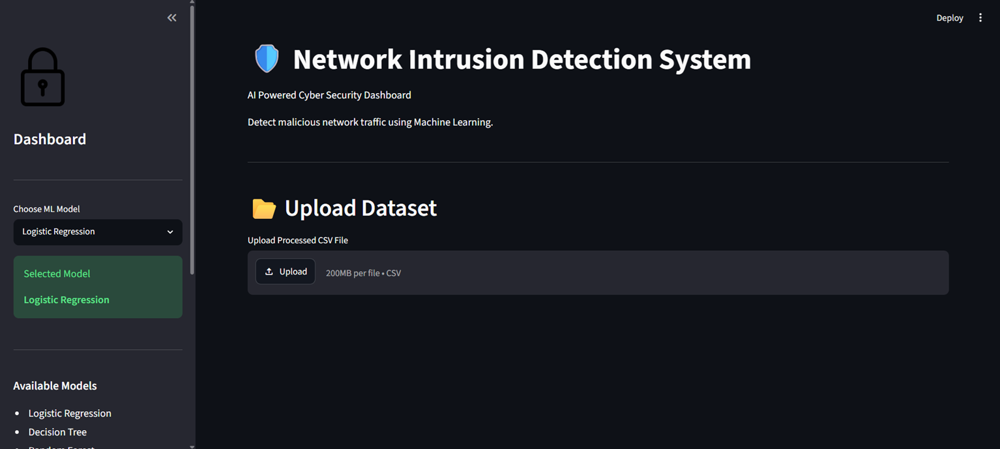
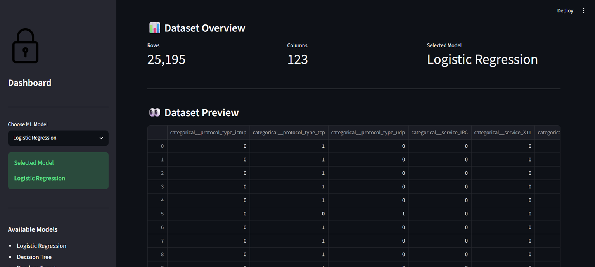
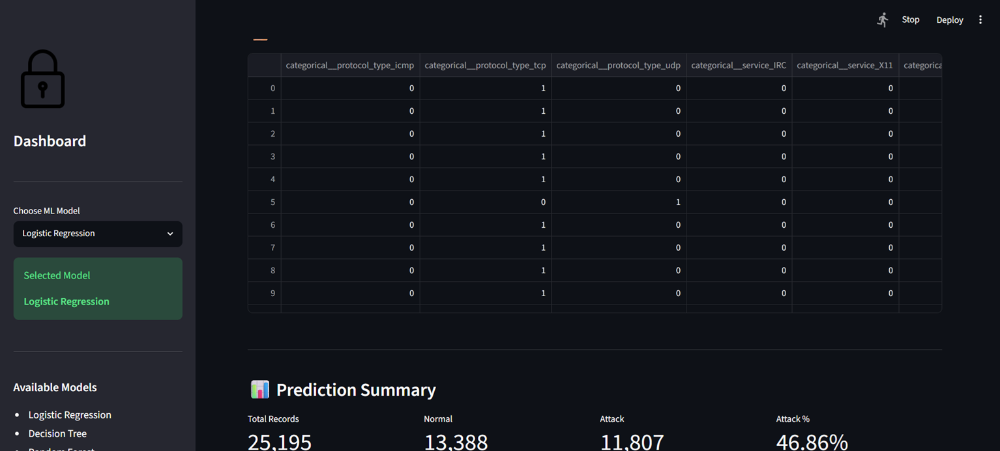
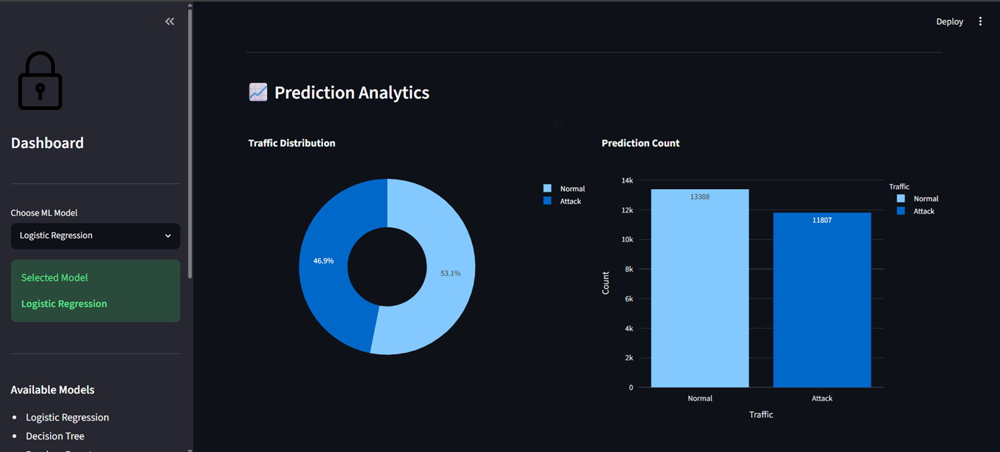
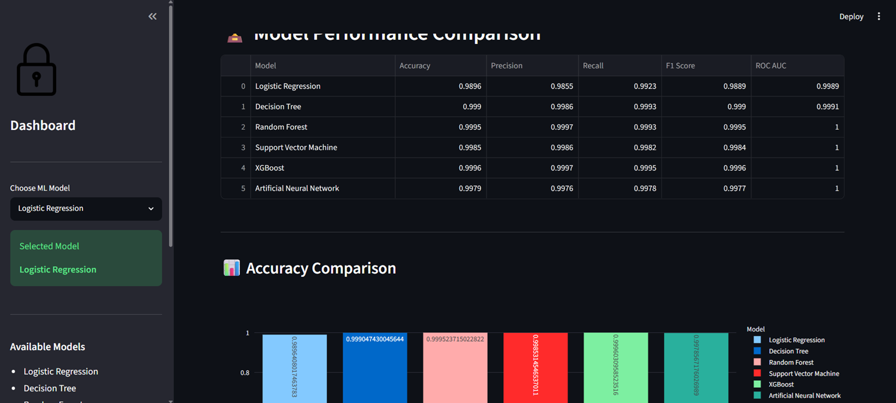

# 🛡️ Network Intrusion Detection System

<p align="center">

AI-Powered Network Intrusion Detection System built using Machine Learning, Deep Learning and Streamlit.

</p>

<p align="center">


</p>

---

## 📌 Overview

This project is an **AI-powered Network Intrusion Detection System (NIDS)** designed to classify network traffic as **Normal** or **Attack** using Machine Learning and Deep Learning models.

The system provides an interactive Streamlit dashboard where users can upload processed network traffic datasets, run intrusion detection, visualize predictions, compare multiple machine learning models, and download prediction results.

The project demonstrates the practical application of cybersecurity, machine learning, and data visualization techniques in detecting malicious network activity.

---
## ✨ Features

- 📂 Upload processed network traffic datasets (.csv)
- 🤖 Detect malicious network traffic using Machine Learning
- 🧠 Deep Learning support using Artificial Neural Network (ANN)
- 📊 Interactive prediction analytics with Plotly
- 📈 Traffic distribution visualization
- 🏆 Compare multiple Machine Learning models
- 📋 Display detailed prediction summary
- 💾 Download prediction results as CSV
- 🎨 Modern and responsive Streamlit dashboard
- ⚡ Fast prediction pipeline with pre-trained models

---

## 🤖 Machine Learning Models

The project supports the following classification algorithms:

| Model | Status |
|--------|--------|
| Logistic Regression | ✅ |
| Decision Tree | ✅ |
| Random Forest | ✅ |
| Support Vector Machine (SVM) | ✅ |
| XGBoost | ✅ |
| Artificial Neural Network (ANN) | ✅ |

---

## 💻 Technology Stack

### Programming Language
- Python 3.11

### Machine Learning
- Scikit-learn
- XGBoost
- TensorFlow / Keras

### Data Processing
- Pandas
- NumPy

### Visualization
- Plotly
- Matplotlib

### Web Framework
- Streamlit

### Model Serialization
- Joblib

---

# 📁 Project Structure

```
Network-Intrusion-Detection/
│
├── api/                    # API related modules
├── assets/                 # README images & screenshots
├── data/                   # Processed datasets
├── docs/                   # Project documentation
├── models/                 # Trained ML/DL models
├── notebooks/              # Jupyter notebooks
├── src/
│   ├── comparison/
│   ├── models/
│   ├── pipeline/
│   ├── utils/
│   └── visualization/
│
├── streamlit_app/          # Streamlit components
├── tests/                  # Unit tests
│
├── app.py                  # Main Streamlit application
├── requirements.txt
├── README.md
├── LICENSE
└── .gitignore
```

---

# ⚙️ Installation

## 1️⃣ Clone the Repository

```bash
git clone https://github.com/HarshitKumarModi/Network-Intrusion-Detection.git
```

---

## 2️⃣ Navigate to the Project

```bash
cd Network-Intrusion-Detection
```

---

## 3️⃣ Create a Virtual Environment

### Windows

```bash
python -m venv venv
```

---

## 4️⃣ Activate the Virtual Environment

### Windows (PowerShell)

```bash
venv\Scripts\Activate
```

---

## 5️⃣ Install Dependencies

```bash
pip install -r requirements.txt
```

---

## ▶️ Run the Application

```bash
streamlit run app.py
```

After running the above command, the application will be available at:

```
http://localhost:8501
```

---

---

# 📸 Dashboard Screenshots

## 🏠 Dashboard



---

## 📂 Dataset Upload



---

## 🤖 Prediction Results



---

## 📊 Prediction Analytics



---

## 🏆 Model Performance Comparison



---

---

# 🚀 Future Improvements

- Real-time packet capture using Scapy
- Live intrusion monitoring dashboard
- Cloud deployment using Streamlit Cloud
- REST API integration with FastAPI
- Docker containerization
- User authentication and login
- Alert notifications through Email/SMS
- Explainable AI using SHAP/LIME
- Support for additional datasets
- Continuous model retraining

---

# 👨‍💻 Author

**Harshit Kumar Modi**

B.Tech Computer Science Engineering  
VIT Bhopal University

### Connect with me

- GitHub: https://github.com/HarshitKumarModi
- LinkedIn: https://www.linkedin.com/in/harshitkumarmodi/


---

# 📄 License

This project is licensed under the MIT License.

See the LICENSE file for more details.